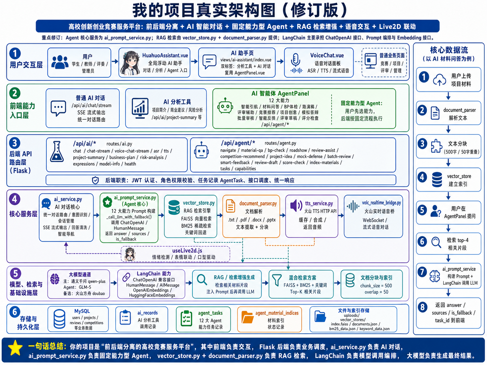
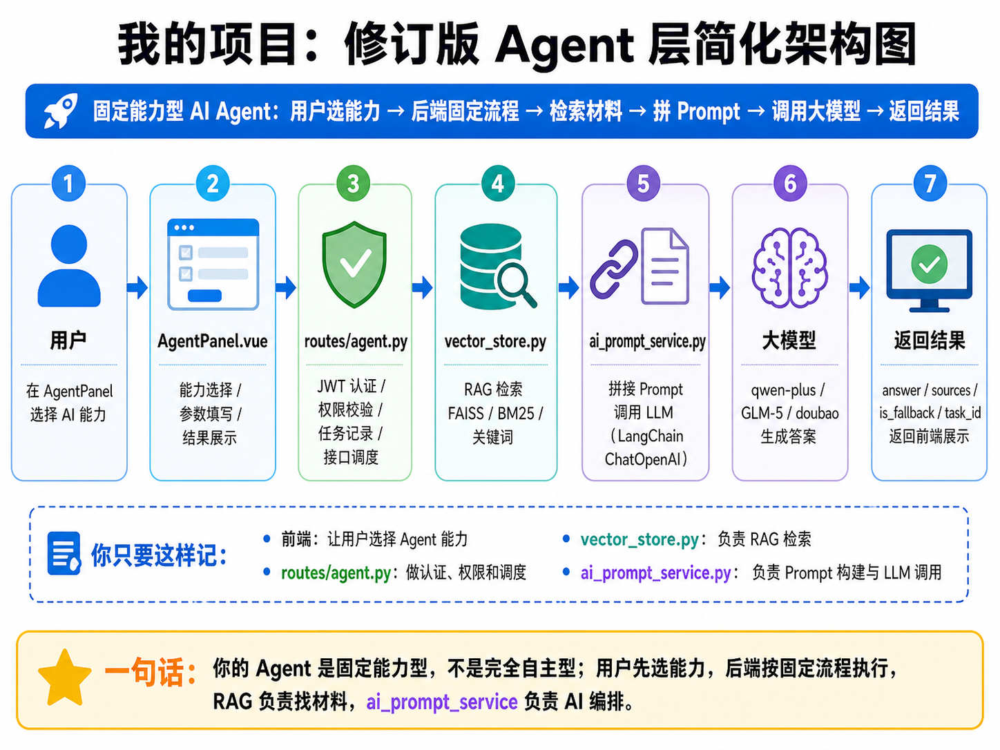
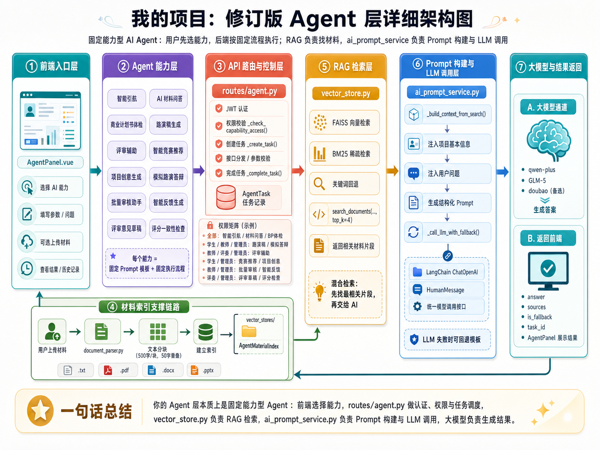

# 火花智创 SparkAI Innovate — AI 智能与 Agent 功能分析报告

> **📌 文档定位**：本文档是 [README.md](./README.md) 的技术补充文档，专注于详细解析平台中 **AI 项目智能体** 的技术架构、实现原理和代码细节。如果你想了解项目整体概况，请先阅读 README.md；如果你想深入了解 AI Agent 是如何工作的、LangChain 在本项目中扮演什么角色、RAG 检索流程是怎样的，那么本文档就是为你准备的。
>
> 分析日期：2026-05-04  
> 分析范围：项目中所有涉及 AI、LangChain、智能体（Agent）、语音交互、Live2D 联动等功能模块

---

## 目录

- [一、AI/Agent 功能全景概览](#一aiagent-功能全景概览)
- [二、AI 智能对话系统](#二ai-智能对话系统)
- [三、统一对话路由与意图识别](#三统一对话路由与意图识别)
- [四、LangChain Agent 智能体系统](#四langchain-agent-智能体系统)
- [五、RAG 检索增强生成系统](#五rag-检索增强生成系统)
- [六、语音交互系统](#六语音交互系统)
- [七、Live2D 虚拟形象联动系统](#七live2d-虚拟形象联动系统)
- [八、AI 分析工具](#八ai-分析工具)
- [九、数据模型与持久化](#九数据模型与持久化)
- [十、整体架构与数据流图](#十整体架构与数据流图)
- [十一、技术原理深度分析](#十一技术原理深度分析)
- [十二、LangChain 概念澄清（面向小白的深度解析）](#十二langchain-概念澄清面向小白的深度解析)
- [十三、总结](#十三总结)

---

## 一、AI/Agent 功能全景概览

本项目的 AI/Agent 功能可归纳为以下 **7 大子系统**：

| 序号 | 子系统                 | 核心技术                                            | 入口                                     |
| ---- | ---------------------- | --------------------------------------------------- | ---------------------------------------- |
| 1    | AI 智能对话            | LangChain + 通义千问 qwen-plus / GLM-5              | HuahuoAssistant.vue、/api/ai/chat/stream |
| 2    | 统一对话路由与意图识别 | LLM 意图分类 + 关键词快速匹配                       | /api/ai/chat/stream (unified_chat)       |
| 3    | LangChain Agent 智能体 | LangChain + FAISS/BM25 混合检索 + Prompt 工程       | AgentPanel.vue、/api/agent/*             |
| 4    | RAG 检索增强生成       | FAISS 向量索引 + BM25 稀疏检索 + 关键词回退         | vector_store.py                          |
| 5    | 语音交互               | Web Speech API / 豆包 ASR / 火山 TTS / 火山实时语音 | VoiceChat.vue、/api/ai/asr、/api/ai/tts  |
| 6    | Live2D 虚拟形象联动    | Cubism5 SDK + 表情/口型驱动 + 情绪检测              | HuahuoAssistant.vue、useLive2d.js        |
| 7    | AI 分析工具            | LLM Prompt 工程 + 模板回退                          | /api/ai/project-summary 等               |

---

## 二、AI 智能对话系统

### 2.1 功能描述

基于大语言模型的多轮对话系统，支持 SSE 流式输出、会话管理、角色感知、回答清洗等能力，是平台的核心 AI 交互入口。

### 2.2 涉及文件

| 层级     | 文件                               | 职责                                             |
| -------- | ---------------------------------- | ------------------------------------------------ |
| 后端服务 | `services/ai_service.py`         | LLM 调用、会话管理、流式输出、意图识别、回答清洗 |
| 后端路由 | `routes/ai.py`                   | 对话接口、流式接口、语音接口、TTS 接口           |
| 前端组件 | `components/HuahuoAssistant.vue` | 全局浮动 AI 助手面板                             |
| 前端页面 | `views/ai-assistant/index.vue`   | 备用 AI 助手页面                                 |
| 前端 API | `api/ai.js`                      | 前端 AI 接口封装                                 |

### 2.3 执行逻辑

```
用户输入消息
    ↓
前端 chatStream() 发起 POST /api/ai/chat/stream
    ↓
后端 generate_unified_stream() 接收请求
    ↓
启动后台线程 _stream_unified_model()
    ↓
判断是否有会话历史：
    ├── 有历史 → 直接调用 call_llm_chat() 进入普通对话
    └── 无历史 → 调用 detect_intent() 进行意图识别
        ├── navigate → smart_navigate() 智能引航
        ├── mock_defense / batch_review / smart_feedback / review_draft / score_check → 调用对应 Agent 能力
        └── chat → call_llm_chat() 普通对话
    ↓
LLM 返回结果 → sanitize_answer_text() 清洗回答
    ↓
split_stream_chunks() 分块 → 通过 Queue 传递
    ↓
SSE 流式返回给前端（delta:xxx\n 格式）
    ↓
前端逐块拼接显示，触发 Live2D 表情联动
```

### 2.4 核心原理

#### 2.4.1 LLM 接入方式

项目采用 **LangChain ChatOpenAI 兼容接口** 接入大模型，支持多模型通道：

- **主通道**：通义千问 qwen-plus（通过 `GLM_API_KEY` / `GLM_BASE_URL` 配置，兼容 OpenAI 接口格式）
- **备选通道**：火山方舟 doubao-seed（通过 `ARK_API_KEY` / `ARK_BASE_URL` 配置）
- **LangChain Agent 通道**：GLM-5（通过 `ai_prompt_service.py` 单独初始化）

```python
# ai_service.py 中的 LLM 初始化
from langchain_openai import ChatOpenAI
_llm_instance = ChatOpenAI(
    model_name=config["model_name"],        # qwen-mt-flash / qwen-plus
    openai_api_key=config["api_key"],
    openai_api_base=config["base_url"],      # dashscope 兼容接口
    temperature=config["temperature"],       # 0.4
    max_tokens=4096,
    timeout=120,
)
```

#### 2.4.2 会话管理

- 使用内存字典 `chat_session_store` 存储会话
- 每个会话保留最近 **6 轮**（12 条消息）上下文
- 会话 TTL 为 **6 小时**，过期自动清理
- 会话 ID 由前端传入或后端自动生成

#### 2.4.3 回答清洗机制（sanitize_answer_text）

由于部分大模型会输出"思考过程"等冗余内容，项目实现了多层清洗：

1. **答案标记提取**：检测"最终答案：""答案："等标记，只取标记后的内容
2. **元信息行过滤**：过滤以"用户问的是""首先我需要""我需要给出"等开头的行
3. **元信息关键词过滤**：过滤包含"自我思考""思考过程""分析步骤"等的行
4. **段落去重**：去除连续重复的段落
5. **半文重复检测**：如果文本前后两半完全相同，只保留一半

#### 2.4.4 SSE 流式输出

- 后端使用 `threading.Thread` + `Queue` 实现异步流式输出
- 前端使用 `fetch` + `ReadableStream` 逐块读取
- 协议格式：`sessionId:xxx\n`、`type:xxx\n`、`delta:xxx\n`、`navigate:xxx\n`、`done:1\n`
- 前端实现重试机制（最大 2 次，递增间隔 1s/2s）+ 3 分钟超时控制

#### 2.4.5 角色感知

系统根据用户角色（学生/教师/评委/管理员）动态调整 AI 回复风格和可用能力：

```python
ROLE_MAP = {'student': '学生', 'teacher': '老师', 'judge': '评委', 'admin': '管理员'}
# 在构建 prompt 时注入角色信息
user_prompt = f"{SYSTEM_PROMPT}\n\n当前用户角色：{role_desc}\n当前场景：{scene_name}\n用户问题：{question}"
```

---

## 三、统一对话路由与意图识别

### 3.1 功能描述

统一对话路由（`unified_chat`）是 AI 对话的核心调度器，根据用户消息自动识别意图并分发到对应的处理逻辑。

### 3.2 意图分类

| 意图               | 说明           | 处理方式                                             |
| ------------------ | -------------- | ---------------------------------------------------- |
| `navigate`       | 用户想跳转页面 | 调用 `smart_navigate()` 返回路由信息               |
| `mock_defense`   | 模拟路演答辩   | 调用 `ai_prompt_service.mock_defense()`            |
| `batch_review`   | 批量审核       | 调用 `ai_prompt_service.batch_review_assist()`     |
| `smart_feedback` | 智能反馈       | 调用 `ai_prompt_service.smart_feedback_generate()` |
| `review_draft`   | 评审草稿       | 调用 `ai_prompt_service.review_draft_generate()`   |
| `score_check`    | 评分一致性检查 | 调用 `ai_prompt_service.score_consistency_check()` |
| `chat`           | 普通对话       | 调用 `call_llm_chat()`                             |

### 3.3 意图识别执行逻辑

```
用户消息进入 _stream_unified_model()
    ↓
判断是否有会话历史：
    ├── 有历史 → 直接走普通对话（避免意图误判）
    └── 无历史 → 进入意图识别
        ↓
    第一步：快速关键词匹配 _quick_detect_navigate()
        ├── 命中导航关键词 → 直接返回 navigate 意图
        └── 未命中 → 进入 LLM 意图识别
            ↓
        第二步：LLM 意图识别 detect_intent()
            ├── 构造意图识别 Prompt（INTENT_PROMPT）
            ├── 调用 LLM 返回 JSON {"intent": "xxx", "params": {}}
            └── 解析 JSON，提取意图和参数
                ├── 解析成功 → 返回识别结果
                └── 解析失败 → 降级为 chat 意图
    ↓
根据意图分发到对应处理逻辑
```

### 3.4 设计原理

**两级意图识别策略**：

1. **快速关键词匹配**（`_quick_detect_navigate`）：对常见导航指令（如"我想报名""看我的项目"）进行快速匹配，避免不必要的 LLM 调用，降低延迟和成本
2. **LLM 意图识别**（`detect_intent`）：对模糊或复杂的用户输入，使用 LLM 进行语义理解，返回结构化 JSON

**有历史直接对话**的设计：当用户已有会话历史时，跳过意图识别直接进入普通对话，避免在多轮对话中误触发意图切换。

---

## 四、LangChain Agent 智能体系统

### 4.1 功能描述

AI 项目智能体提供 12 大专项 AI 能力，基于 LangChain + FAISS/BM25 混合检索技术实现，为不同角色用户提供差异化的智能辅助。

#### 项目真实架构图



**一句话总结**：你的项目是"前后端分离的高校竞赛服务平台"，其中前端负责交互，Flask 后端负责业务调度，`ai_service.py` 负责 AI 对话，`ai_prompt_service.py` 负责固定能力型 Agent，`vector_store.py` + `document_parser.py` 负责 RAG 检索，LangChain 负责模型调用编排，大模型负责生成最终结果。

### 4.2 12 大 AI 能力清单

| 序号 | 能力           | API 端点                         | 可用角色         | 是否需要项目 | 是否需要索引 |
| ---- | -------------- | -------------------------------- | ---------------- | ------------ | ------------ |
| 1    | 智能引航       | `/agent/navigate`              | 全部             | 否           | 否           |
| 2    | AI 材料问答    | `/agent/material-qa`           | 全部             | 是           | 是           |
| 3    | 商业计划书体检 | `/agent/bp-check`              | 全部             | 是           | 是           |
| 4    | 路演稿生成     | `/agent/roadshow`              | 学生/教师/管理员 | 是           | 可选         |
| 5    | 评审辅助       | `/agent/review-assist`         | 教师/评委/管理员 | 是           | 是           |
| 6    | 智能竞赛推荐   | `/agent/competition-recommend` | 学生/管理员      | 是           | 否           |
| 7    | 项目创意生成   | `/agent/project-idea`          | 学生/管理员      | 否           | 否           |
| 8    | 模拟路演答辩   | `/agent/mock-defense`          | 学生/教师/管理员 | 可选         | 可选         |
| 9    | 批量审核助手   | `/agent/batch-review`          | 教师/管理员      | 否           | 否           |
| 10   | 智能反馈生成   | `/agent/smart-feedback`        | 教师/管理员      | 是           | 是           |
| 11   | 评审意见草稿   | `/agent/review-draft`          | 评委/管理员      | 是           | 是           |
| 12   | 评分一致性检查 | `/agent/score-check`           | 评委/管理员      | 否           | 否           |

### 4.3 涉及文件

| 层级     | 文件                                  | 职责                               |
| -------- | ------------------------------------- | ---------------------------------- |
| 后端服务 | `services/ai_prompt_service.py`     | 12 大能力的 Prompt 构建与 LLM 调用 |
| 后端路由 | `routes/agent.py`                   | Agent API 端点、权限校验、任务记录 |
| 后端服务 | `services/vector_store.py`          | FAISS/BM25/关键词三级检索引擎      |
| 后端服务 | `services/document_parser.py`       | 文档解析（.txt/.pdf/.docx/.pptx）  |
| 前端组件 | `views/ai-assistant/AgentPanel.vue` | 智能体能力选择与参数表单           |
| 前端 API | `api/agent.js`                      | Agent 接口封装                     |

#### Agent 层简化架构图



**你只要这样记**：
- **前端**：让用户选择 Agent 能力
- **routes/agent.py**：做认证、权限和调度
- **vector_store.py**：负责 RAG 检索
- **ai_prompt_service.py**：负责 Prompt 构建与 LLM 调用

**一句话**：你的 Agent 是固定能力型，不是完全自主型；用户先选能力，后端按固定流程执行，RAG 负责找材料，`ai_prompt_service` 负责 AI 编排。

### 4.4 执行逻辑（以"AI 材料问答"为例）

```
用户在 AgentPanel 选择"AI 材料问答"
    ↓
填写问题、选择项目/报名
    ↓
前端调用 materialQa({ project_id, question })
    ↓
POST /api/agent/material-qa
    ↓
后端 agent.py 处理：
    ├── JWT 认证 → 获取用户
    ├── 权限校验 → _check_capability_access()
    ├── 创建任务记录 → _create_task()
    ├── 检查索引是否存在 → index_exists()
    ├── 检索相关材料 → search_documents('project', project_id, question, top_k=4)
    ├── 构建项目信息文本 → _get_project_info_text()
    ├── 调用 ai_prompt_service.material_qa()
    │   ├── 构建检索上下文 → _build_context_from_search()
    │   ├── 构建 Prompt（含检索结果 + 项目信息 + 用户问题）
    │   ├── 调用 LLM → _call_llm_with_fallback()
    │   │   ├── 成功 → 返回 LLM 回答
    │   │   └── 失败 → 返回回退模板
    │   └── 提取来源信息
    ├── 完成任务记录 → _complete_task()
    └── 返回结果 { answer, sources, is_fallback, task_id }
    ↓
前端 AgentPanel 展示结果（Markdown 渲染 + 复制 + 朗读）
```

### 4.5 核心设计原理

#### 4.5.1 Prompt 工程模式

每个 Agent 能力都采用 **结构化 Prompt 模板**，包含：

1. **角色设定**：如"你是高校创新创业竞赛服务平台的 AI 助手"
2. **上下文注入**：检索到的材料片段（RAG）或项目基本信息
3. **任务指令**：明确要求输出的格式和内容结构
4. **输出格式约束**：要求使用 Markdown 格式，指定章节结构

```python
# 以 material_qa 为例的 Prompt 结构
prompt = f"""你是高校创新创业竞赛服务平台的 AI 助手，专门帮助用户理解项目材料内容。

以下是检索到的相关项目材料片段：
{context}

项目基本信息：
{project_info}

用户问题：{question}

请基于以上材料和信息回答用户问题。要求：
1. 回答要准确、具体，尽量引用材料中的内容
2. 如果材料不足以回答问题，请明确说明
3. 回答使用中文"""
```

#### 4.5.2 降级回退机制（_call_llm_with_fallback）

每个 Agent 能力都实现了 **LLM 调用 + 模板回退** 的双保险机制：

- LLM 调用成功 → 返回 AI 生成的专业内容
- LLM 调用失败 → 返回预设的模板内容，确保用户始终能得到有意义的反馈

```python
def _call_llm_with_fallback(prompt_text, fallback_template=''):
    llm = get_llm()
    if llm is None:
        return fallback_template or 'AI 服务暂不可用', True  # is_fallback=True
    try:
        response = llm.invoke([HumanMessage(content=prompt_text)])
        return response.content, False  # is_fallback=False
    except Exception as e:
        return fallback_template or f'AI 服务调用失败', True  # is_fallback=True
```

#### 4.5.3 权限控制

Agent 能力按角色进行细粒度权限控制：

```python
def _check_capability_access(user, capability, project=None):
    # 评审辅助：仅教师/评委/管理员
    if capability == 'review_assist':
        if user.role not in ('teacher', 'judge', 'admin'):
            return False, '评审辅助仅限教师、评委和管理员使用'
    # 竞赛推荐：仅学生/管理员
    if capability == 'competition_recommend':
        if user.role not in ('student', 'admin'):
            return False, '智能竞赛推荐仅限学生使用'
    # ... 其他能力类似
```

#### 4.5.4 任务记录系统

每次 Agent 调用都会创建 `AgentTask` 记录，包含：

- 用户 ID、项目 ID、能力类型
- 输入参数（JSON）
- 执行结果（JSON）
- 状态（pending/completed/failed）
- 创建时间、完成时间

---

## 五、RAG 检索增强生成系统

### 5.1 功能描述

RAG（Retrieval-Augmented Generation）系统是 Agent 智能体的基础设施，负责将用户上传的项目材料文档解析、分块、向量化索引，并在 Agent 调用时检索相关内容注入 Prompt。

### 5.2 涉及文件

| 文件                            | 职责                                  |
| ------------------------------- | ------------------------------------- |
| `services/vector_store.py`    | 三级检索引擎（FAISS / BM25 / 关键词） |
| `services/document_parser.py` | 文档解析（.txt/.pdf/.docx/.pptx）     |

### 5.3 三级检索引擎架构

```
检索请求
    ↓
优先级 1：FAISS 向量检索
    ├── 可用 → 使用 Embedding 向量 + L2 距离检索
    └── 不可用 → 降级到优先级 2
        ↓
优先级 2：BM25 稀疏检索
    ├── 可用 → 使用 BM25Plus + jieba 中文分词检索
    └── 不可用 → 降级到优先级 3
        ↓
优先级 3：关键词匹配检索
    └── 基于词汇重叠度的简单匹配
```

### 5.4 核心原理

#### 5.4.1 FAISS 向量索引

```python
class FAISSIndex:
    def _get_embeddings(self):
        # 优先使用火山方舟 Embedding API
        from langchain_openai import OpenAIEmbeddings
        self._embeddings = OpenAIEmbeddings(
            model='doubao-embedding',
            openai_api_key=os.getenv('ARK_API_KEY'),
            openai_api_base=os.getenv('ARK_BASE_URL'),
        )
        # 降级到本地 HuggingFace Embedding
        from langchain_community.embeddings import HuggingFaceEmbeddings
        self._embeddings = HuggingFaceEmbeddings(
            model_name='shibing624/text2vec-base-chinese',
        )

    def build(self, documents, metadatas):
        # 文本 → 向量 → FAISS IndexFlatL2 索引
        vectors = embeddings.embed_documents(texts)
        self.index = faiss.IndexFlatL2(dimension)
        self.index.add(vectors)

    def search(self, query, top_k=4):
        # 查询 → 向量 → L2 距离检索 → 返回 top_k 结果
        query_vector = embeddings.embed_query(query)
        distances, indices = self.index.search(query_vector, top_k)
```

**原理**：FAISS（Facebook AI Similarity Search）使用 L2 欧氏距离度量向量相似度。文档被 Embedding 模型编码为高维向量后，通过 IndexFlatL2 暴力搜索找到与查询向量最近的 k 个文档块。

#### 5.4.2 BM25 稀疏检索

```python
class BM25Index:
    def build(self, documents, metadatas):
        # jieba 中文分词 → BM25Plus 索引
        self.tokenized_corpus = [_simple_tokenize(doc) for doc in documents]
        self.bm25 = BM25Plus(self.tokenized_corpus)

    def search(self, query, top_k=4):
        # 查询分词 → BM25 打分 → 返回 top_k
        tokenized_query = _simple_tokenize(query)
        scores = self.bm25.get_scores(tokenized_query)
```

**原理**：BM25（Best Matching 25）是基于词频和文档频率的经典信息检索算法。BM25Plus 是其改进版本，增加了文档长度归一化和词频饱和控制。使用 jieba 进行中文分词以支持中文查询。

#### 5.4.3 文档解析与分块

```
上传文档（.txt/.pdf/.docx/.pptx）
    ↓
document_parser.py 解析提取文本
    ├── .txt → 直接读取（支持 UTF-8/GBK）
    ├── .pdf → pypdf 逐页提取文本
    ├── .docx → python-docx 提取段落 + 表格
    └── .pptx → python-pptx 提取幻灯片文本 + 表格
    ↓
vector_store.py 文本分块
    ├── chunk_size = 500 字符
    ├── overlap = 50 字符（滑动窗口重叠）
    └── 每块附带元数据（file_id, file_name, chunk_index）
    ↓
构建索引（FAISS → BM25 → 关键词，按可用性降级）
    ↓
索引持久化到磁盘（vector_stores/ 目录）
```

**分块原理**：滑动窗口分块（chunk_size=500, overlap=50）确保：

1. 每个文本块不超过 Embedding 模型的有效处理长度
2. 相邻块有 50 字符重叠，避免语义断裂
3. 检索时能获取到完整的上下文片段

---

## 六、语音交互系统

### 6.1 功能描述

多通道语音交互系统，支持语音识别（ASR）、语音合成（TTS）、实时语音对话，兼容 Chrome/Edge/Firefox 多浏览器。

### 6.2 涉及文件

| 文件                                   | 职责                            |
| -------------------------------------- | ------------------------------- |
| `services/tts_service.py`            | 火山 TTS HTTP API 语音合成      |
| `services/volc_realtime_bridge.py`   | 火山实时语音对话 WebSocket 桥接 |
| `services/volc_realtime_protocol.py` | 火山实时语音二进制协议解析      |
| `routes/ai.py`                       | ASR/TTS/语音配置 API 端点       |
| `components/VoiceChat.vue`           | 语音对话面板组件                |

### 6.3 语音识别（ASR）执行逻辑

```
用户点击麦克风
    ↓
判断浏览器类型：
    ├── Chrome/Edge → Web Speech API（webkitSpeechRecognition）
    │   ├── 实时语音转文字
    │   └── 自动发送消息
    └── Firefox → 录音上传后端 ASR
        ├── MediaRecorder 录制 5 秒音频
        ├── 上传 webm 文件到 /api/ai/asr
        ├── 后端 ffmpeg 转 wav
        ├── 豆包 ASR（WebSocket）识别
        │   ├── 成功 → 返回识别文本
        │   └── 失败 → 降级到 faster-whisper
        │       ├── 加载 small 模型
        │       ├── 本地推理识别
        │       └── OpenCC 繁转简
        └── 返回识别文本
```

### 6.4 语音合成（TTS）执行逻辑

```
用户点击朗读按钮
    ↓
优先使用浏览器 SpeechSynthesis API
    ├── 可用 → 直接朗读
    └── 不可用/需要更高质量 → 调用火山 TTS
        ↓
    POST /api/ai/tts/synthesize
        ↓
    tts_service.py：
        ├── 检查缓存（MD5 key + 7天 TTL）
        ├── 构建请求 payload（speaker/speed/volume/pitch）
        ├── 调用火山 TTS HTTP API
        ├── 解码 Base64 音频数据
        ├── 保存为 MP3 文件
        └── 返回音频 URL
```

### 6.5 火山实时语音对话

```
用户发送语音消息（use_voice=True）
    ↓
POST /api/ai/voice/chat/stream
    ↓
ai_service.py → _stream_voice_model()
    ↓
判断火山实时语音是否配置：
    ├── 已配置 → volc_realtime_bridge.run_text_dialog()
    │   ├── WebSocket 连接火山实时语音服务
    │   ├── 发送会话初始化请求
    │   ├── 发送用户文本
    │   ├── 接收流式 AI 回复（含 ASR + LLM + TTS）
    │   ├── 解析二进制协议（volc_realtime_protocol.py）
    │   └── 清洗回答文本
    └── 未配置 → 降级到普通 LLM 对话
```

### 6.6 火山实时语音协议原理

`volc_realtime_protocol.py` 实现了火山引擎实时语音服务的自定义二进制协议：

```
协议头格式（4 字节）：
[版本(4bit) | 头大小(4bit)] [消息类型(4bit) | 消息标志(4bit)] [序列化方式(4bit) | 压缩方式(4bit)] [保留字节]

消息类型：
- CLIENT_FULL_REQUEST (0b0001)：客户端完整请求
- SERVER_FULL_RESPONSE (0b1001)：服务端完整响应
- SERVER_ACK (0b1011)：服务端确认
- SERVER_ERROR_RESPONSE (0b1111)：服务端错误

序列化方式：JSON (0b0001)
压缩方式：GZIP (0b0001)

Payload 结构：
[event_id(4字节)] [session_id_length(4字节) + session_id] [payload_size(4字节) + payload(gzip+json)]
```

---

## 七、Live2D 虚拟形象联动系统

### 7.1 功能描述

> **📚 详细技术文档**：关于 Live2D 表情系统的完整实现机制、叠加效果共存逻辑、情绪关键词触发机制等详细说明，请参阅 [Live2D-表情系统实现文档.md](./Live2D-表情系统实现文档.md)。

Live2D 虚拟形象「火花」作为平台的 AI 交互入口，实现表情联动、口型驱动、情绪检测等沉浸式交互体验。

### 7.2 涉及文件

| 文件                               | 职责                                      |
| ---------------------------------- | ----------------------------------------- |
| `components/HuahuoAssistant.vue` | Live2D 加载、表情控制、对话面板、拖拽管理 |
| `composables/useLive2d.js`       | 情绪检测、表情映射、Live2D 钩子           |
| `public/live2d/huahuo/`          | Live2D 模型资源（Cubism5 格式）           |
| `public/live2d-widget-dist/`     | Live2D Widget SDK                         |

### 7.3 表情联动执行逻辑

```
AI 回复文本到达前端
    ↓
notifyLive2dHook('onDelta', { text: delta })
    ↓
useLive2d.js → detectEmotionByText(delta)
    ├── 匹配情绪关键词：
    │   ├── 开心/高兴/棒 → 'happy' → '02 脸红爱心'
    │   ├── 害羞/脸红 → 'shy' → '02 脸红爱心'
    │   ├── 生气/愤怒 → 'angry' → '03 生气'
    │   ├── 难过/伤心 → 'sad' → '08 流泪'
    │   ├── 晕/困惑 → 'dizzy' → '04 晕'
    │   └── 惊讶/哇 → 'surprise' → '07 星星眼'
    └── 无匹配 → 保持当前表情
    ↓
setBaseExpression(exprName)
    ↓
window.__syncExpressionState(model)
    ├── 重置表情相关参数
    ├── 设置基础表情 model.setExpression(name)
    └── 应用 overlay 修饰效果（月卡/水印）
```

### 7.4 口型驱动原理

```
语音朗读开始
    ↓
startSpeechMouthPulse()
    ↓
每 80ms 计算口型开合度：
    intensity = 0.3 + 0.5 * |sin(elapsed * 6)|
    ↓
设置 window.__speechMouthOpenY = intensity
    ↓
在 core.update() 的后置钩子中：
    __applySpeechStateToCore(core)
    → 设置 ParamMouthOpenY 参数值
    ↓
Live2D 模型每帧更新时自动应用口型参数
```

**原理**：使用正弦波模拟口型开合节奏，`sin(elapsed * 6)` 产生约 1Hz 的口型变化频率，模拟自然说话节奏。在 Cubism5 模型的 `core.update()` 方法上做 Monkey-Patch，在每帧渲染后注入口型参数。

### 7.5 表情 Overlay 共存系统

项目实现了基础表情与修饰效果（月卡/水印）的共存机制：

```
设置基础表情
    ↓
重置表情相关参数（ParamEyeSmile/ParamEyeOpen/ParamTear）
    ↓
调用 model.setExpression(baseExpression)
    ↓
应用 Overlay 状态：
    ├── 月卡 → 设置 key9 = 1
    └── 水印 → 设置 key12/Param45/48/49/50 = 1
    ↓
在 core.update() 前置钩子中自动应用 Overlay
```

---

## 八、AI 分析工具

### 8.1 功能描述

提供项目简介生成、商业计划书建议、风险分析三种 AI 分析工具，支持 LLM 生成 + 模板回退。

### 8.2 执行逻辑

```
用户填写项目信息（名称/简介/类别/赛道）
    ↓
选择 AI 功能（项目简介/商业建议/风险分析）
    ↓
点击"开始生成"
    ↓
POST /api/ai/project-summary（或 business-plan-advice / risk-analysis）
    ↓
ai_service.py 中对应函数：
    ├── 构建 Prompt（含项目信息）
    ├── 调用 call_llm_chat()
    │   ├── 成功 → 返回 AI 生成内容
    │   └── 失败 → 返回预设模板
    └── 记录到 AiRecord 表
    ↓
前端 Markdown 渲染 + 一键复制 + 朗读
```

---

## 九、数据模型与持久化

### 9.1 AI 相关数据模型

| 模型                   | 表名                       | 用途                                              |
| ---------------------- | -------------------------- | ------------------------------------------------- |
| `AiRecord`           | `ai_records`             | AI 分析工具调用记录（项目简介/商业建议/风险分析） |
| `AgentTask`          | `agent_tasks`            | Agent 智能体任务记录（12 大能力的调用记录）       |
| `AgentMaterialIndex` | `agent_material_indexes` | 材料索引状态记录（哪些文件已建立索引）            |

### 9.2 AgentTask 模型结构

```python
class AgentTask(db.Model):
    id              # 主键
    user_id         # 用户 ID（外键）
    project_id      # 项目 ID（外键，可空）
    registration_id # 报名 ID（外键，可空）
    capability      # 能力类型（如 material_qa, bp_check 等）
    input_params    # 输入参数（JSON 文本）
    result          # 执行结果（JSON 文本）
    status          # 状态：pending / completed / failed
    error_message   # 错误信息
    created_at      # 创建时间
    completed_at    # 完成时间
```

### 9.3 会话存储

- AI 对话会话使用 **内存字典** `chat_session_store` 存储，不持久化到数据库
- 每个会话包含消息列表和更新时间
- 6 小时 TTL 自动过期清理

### 9.4 索引存储

- FAISS 索引文件存储在 `backend/vector_stores/` 目录
- 每个索引包含：`index.faiss`（向量索引）、`documents.json`（文档和元数据）
- BM25 索引文件：`bm25_data.json`
- 关键词索引文件：`keyword_data.json`

---

## 十、整体架构与数据流图

### 10.1 前端入口层级

```
用户交互层
│
├── HuahuoAssistant.vue（唯一主要 AI 入口，全局浮动）
│   ├── mode === 'chat'        → 对话模式
│   │   ├── 文字输入 → chatStream() → /api/ai/chat/stream
│   │   ├── 语音输入 → Web Speech API / 后端 ASR
│   │   └── SSE 流式接收 → Live2D 表情联动
│   ├── mode === 'analysis'    → AI 分析模式
│   │   └── 项目简介/商业建议/风险分析 → /api/ai/*
│   └── mode === 'agent'       → AI 智能体模式
│       └── AgentPanel.vue → 12 大能力 → /api/agent/*
│
├── /ai-assistant 页面（备用入口）
│   ├── Tab 1: AI 分析工具
│   ├── Tab 2: AI 对话
│   └── Tab 3: AI 智能体（复用 AgentPanel.vue）
│
└── VoiceChat.vue（语音对话面板）
```

### 10.2 后端 API 分层

```
/api/ai/*                           /api/agent/*
┌─────────────────────┐            ┌─────────────────────┐
│ 通用 AI 服务         │            │ Agent 智能体服务      │
│                     │            │                     │
│ • chat              │            │ • material-qa       │
│ • chat/stream       │            │ • bp-check          │
│ • voice/chat/stream │            │ • roadshow          │
│ • asr               │            │ • review-assist     │
│ • tts/synthesize    │            │ • competition-recommend│
│ • project-summary   │            │ • navigate          │
│ • business-plan     │            │ • project-idea      │
│ • risk-analysis     │            │ • mock-defense      │
│ • expressions       │            │ • batch-review      │
│ • model-info        │            │ • smart-feedback    │
│ • health            │            │ • review-draft      │
│                     │            │ • score-check       │
│                     │            │ • index-materials   │
│                     │            │ • tasks             │
│                     │            │ • capabilities      │
└─────────────────────┘            └─────────────────────┘
         │                                   │
         ▼                                   ▼
   ai_service.py                    ai_prompt_service.py
   (LLM + 会话 + 流式)              (Prompt + LLM + RAG)
         │                                   │
         └───────────┬───────────────────────┘
                     ▼
              vector_store.py
              (FAISS / BM25 / 关键词)
                     │
                     ▼
            document_parser.py
            (.txt / .pdf / .docx / .pptx)
```

### 10.3 完整数据流（AI 材料问答）

```
[1] 用户上传项目文件
        ↓
[2] document_parser.py 解析文档 → 提取文本
        ↓
[3] vector_store.py 文本分块（500字/块，50字重叠）
        ↓
[4] FAISS/BM25 构建索引 → 持久化到磁盘
        ↓
[5] 用户提问 "这个项目的创新点是什么？"
        ↓
[6] vector_store.py 检索 top-4 相关文本块
        ↓
[7] ai_prompt_service.py 构建 Prompt：
    ├── 系统角色设定
    ├── 检索到的材料片段（RAG 上下文）
    ├── 项目基本信息
    └── 用户问题
        ↓
[8] LangChain ChatOpenAI 调用 GLM-5 / qwen-plus
        ↓
[9] LLM 返回回答 → 清洗 → 返回前端
        ↓
[10] 前端 Markdown 渲染 + Live2D 表情联动 + 朗读
```

---

## 十一、技术原理深度分析

### 11.1 RAG（检索增强生成）原理

RAG 是本项目的核心技术范式，其原理是：

1. **离线索引阶段**：将文档分块后编码为向量，构建索引
2. **在线检索阶段**：将用户问题编码为向量，在索引中检索最相关的文档块
3. **增强生成阶段**：将检索到的文档块作为上下文注入 LLM Prompt，让 LLM 基于真实材料回答

**为什么需要 RAG？**

- LLM 的知识有截止日期，不了解用户的具体项目材料
- RAG 让 LLM 能基于用户上传的真实文档回答问题，减少幻觉
- 检索到的材料片段作为"证据"，提高回答的可信度和可追溯性

### 11.2 混合检索原理

项目采用 FAISS + BM25 + 关键词三级混合检索：

- **FAISS（稠密检索）**：基于语义相似度，能理解"创新点"和"核心优势"是相关的，即使字面不同
- **BM25（稀疏检索）**：基于词频匹配，对精确关键词查询更准确，且不需要 Embedding 模型
- **关键词（回退检索）**：最简单的词汇重叠匹配，确保在任何环境下都能工作

**降级策略**：FAISS 优先（语义理解最强）→ BM25 次之（精确匹配）→ 关键词兜底（零依赖）

### 11.3 LangChain 框架的作用

LangChain 在项目中的作用：

1. **统一 LLM 接口**：通过 `ChatOpenAI` 兼容接口接入不同大模型（通义千问、GLM、火山方舟）
2. **消息管理**：使用 `HumanMessage` / `AIMessage` 标准化对话历史
3. **Embedding 接口**：通过 `OpenAIEmbeddings` / `HuggingFaceEmbeddings` 统一向量化接口
4. **可扩展性**：为未来引入 Agent Chain、Tool Calling 等高级能力提供基础

### 11.4 SSE 流式输出原理

```
后端：
    threading.Thread + Queue
    ├── 工作线程：调用 LLM → 清洗回答 → 分块 → 放入 Queue
    └── 主线程：从 Queue 取出 → yield SSE 事件

前端：
    fetch() + ReadableStream
    ├── 发起 POST 请求
    ├── 获取 response.body.getReader()
    ├── 循环 reader.read() 逐块读取
    ├── 解析 SSE 格式（sessionId:/delta:/done:）
    └── 逐块更新 UI（打字机效果）
```

### 11.5 意图识别原理

意图识别采用 **关键词快速匹配 + LLM 语义理解** 的两级策略：

1. **关键词匹配**（`_quick_detect_navigate`）：对明确的导航指令（如"我想报名""看竞赛"）直接匹配，零延迟
2. **LLM 意图识别**（`detect_intent`）：对模糊输入使用 LLM 进行语义理解，返回结构化 JSON

这种设计在保证准确率的同时，将大部分常见请求的延迟降到最低。

---

## 十二、LangChain 概念澄清（面向小白的深度解析）

> 本章节以通俗易懂的方式解释 LangChain、RAG、FAISS、BM25 等概念，并明确指出哪些技术属于 LangChain，哪些是独立的技术。内容基于项目实际代码分析，确保准确无误。
> 对应对话日期：2026-05-04

### 12.1 先说结论：它们到底是什么？

用一张图说清楚它们之间的关系：

```
                    ┌─────────────────────────────┐
                    │         LangChain           │ ← 主框架/工具箱（官方维护）
                    │    （全家桶工具箱本体）       │
                    └──────────────┬──────────────┘
                                   │
           ┌───────────────────────┼───────────────────────┐
           │                       │                       │
           ↓                       ↓                       ↓
┌──────────────────┐   ┌──────────────────┐   ┌──────────────────┐
│       RAG         │   │      FAISS        │   │       BM25        │
│  检索增强生成     │   │  向量相似度搜索    │   │   关键词检索     │
│                  │   │                  │   │                  │
│ 不是库！         │   │ Facebook开发     │   │ 学术界发明的     │
│ 一种技术方案/思想 │   │ 独立向量数据库    │   │ 经典检索算法    │
└──────────────────┘   └──────────────────┘   └──────────────────┘
```

**重要区分**：

- **LangChain** = 框架，提供一套工具帮你把各种组件组合起来用
- **RAG** = 一种技术思想/方案（不是库！）
- **FAISS** = 具体的技术库（Facebook/Meta 开发的）
- **BM25** = 具体的技术算法（学术界发明的）

---

### 12.2 核心问题：LangChain 到底是什么？

**LangChain 只是一个"框架/工具箱"，它本身不提供 AI 能力！**

#### 12.2.1 用餐厅来类比

```
┌─────────────────────────────────────────────────────────────────────┐
│                                                                      │
│   ╔═══════════════════════════════════════════════════════════╗    │
│   ║                    一家 AI 餐厅                               ║    │
│   ╠═══════════════════════════════════════════════════════════╣    │
│   ║                                                                   ║    │
│   ║   LangChain  = 厨房设备（锅碗瓢盆、菜刀、炉灶）              ║    │
│   ║                    ↓                                          ║    │
│   ║                    │                                          ║    │
│   ║   大模型 API  = 食材（蔬菜、肉类、调料）                       ║    │
│   ║                    ↓                                          ║    │
│   ║                    │                                          ║    │
│   ║   API Key     = 购买食材的会员卡/资格                         ║    │
│   ║                                                                   ║    │
│   ╚═══════════════════════════════════════════════════════════╝    │
│                                                                      │
└─────────────────────────────────────────────────────────────────────┘
```

**你有了厨房设备（LangChain），但你还是需要：**

1. 去买食材（大模型 API）
2. 有会员卡才能买（API Key）

#### 12.2.2 不用 LangChain 也能做！

```
┌─────────────────────┐         ┌─────────────────────┐
│    用 LangChain     │   或者   │    直接用 requests  │
│    全家桶           │         │    调用 API         │
└──────────┬──────────┘         └──────────┬──────────┘
           │                               │
           ↓                               ↓
┌─────────────────────────────────────────────────────┐
│              大模型 API（必须！）                    │
│                                                     │
│   • GPT-4（OpenAI）                                │
│   • GLM-5（豆包/智谱）                             │
│   • Claude（Anthropic）                            │
│   • 通义千问（阿里）                               │
│   • 文心一言（百度）                               │
│   • ...                                            │
└─────────────────────────────────────────────────────┘
           ↑                               ↑
           │                               │
      需要 API Key                      需要 API Key
```

---

### 12.3 你的项目是否需要 API Key？

**是的，100% 需要！**

你的项目 `.env` 文件中配置了：

```python
# ai_prompt_service.py 第36-55行
def get_llm():
    global _llm
    if _llm is not None:
        return _llm
    try:
        from langchain_openai import ChatOpenAI
        _llm = ChatOpenAI(
            model_name=os.getenv('GLM_MODEL', 'glm-5'),      # 模型名
            openai_api_key=os.getenv('GLM_API_KEY'),         # ← 智谱的 Key！
            openai_api_base=os.getenv('GLM_BASE_URL', 'https://open.bigmodel.cn/api/paas/v4'),  # ← API 地址
            temperature=0.4,
            max_tokens=4096,
            timeout=120,
            request_timeout=120,
        )
        logger.info('GLM-5 LLM 初始化成功')
        return _llm
    except Exception as e:
        logger.error(f'LLM 初始化失败: {e}')
        return None
```

**没有 API Key 会怎样？**

```
没有 API Key = 厨师生不了火 = 做不了菜
                ↓
         AI 服务完全不可用
```

---

### 12.4 RAG 是什么？来自 LangChain 吗？

**RAG 不是 LangChain 的！它是独立的技术方案！**

#### 12.4.1 什么是 RAG？

RAG = **R**etrieval-**A**ugmented **G**eneration（检索增强生成）

#### 12.4.2 用考试来类比

```
┌─────────────────────────────────────────────────────────────────┐
│                                                                   │
│   没有 RAG = 裸考                                                  │
│                                                                   │
│   ╔═══════════════════════════════════════════════════════════╗  │
│   ║  只能靠记忆（可能瞎编）                                      ║  │
│   ║                                                            ║  │
│   ║  大模型说："根据我的训练数据，我认为..."                    ║  │
│   ║                                                            ║  │
│   ║  ❌ 可能是瞎编的！                                         ║  │
│   ╚═══════════════════════════════════════════════════════════╝  │
│                                                                   │
├─────────────────────────────────────────────────────────────────┤
│                                                                   │
│   有 RAG = 开卷考试                                               │
│                                                                   │
│   ╔═══════════════════════════════════════════════════════════╗  │
│   ║  可以查资料（基于真实材料回答）                              ║  │
│   ║                                                            ║  │
│   ║  大模型说："根据你提供的文档，我分析如下..."                 ║  │
│   ║                                                            ║  │
│   ║  ✅ 基于真实材料，有据可查！                                 ║  │
│   ╚═══════════════════════════════════════════════════════════╝  │
│                                                                   │
└─────────────────────────────────────────────────────────────────┘
```

#### 12.4.3 RAG 的工作流程（详细）

```
┌────────────────────────────────────────────────────────────────────┐
│                        RAG 工作流程                                 │
├────────────────────────────────────────────────────────────────────┤
│                                                                     │
│  用户问题："分析我的商业计划书创新点"                               │
│                              ↓                                     │
│                                                                     │
│  ┌────────────────────────────────────────────────────────────┐   │
│  │ 第一步：检索（Retrieval）                                    │   │
│  │                                                              │   │
│  │    从你的文档中找到相关段落                                  │   │
│  │    ↓                                                        │   │
│  │    例如找到：                                                │   │
│  │    • 第3页："本项目采用XXX技术创新..."                     │   │
│  │    • 第5页："相比同类产品，我们解决了YYY问题..."           │   │
│  └────────────────────────────────────────────────────────────┘   │
│                              ↓                                     │
│  ┌────────────────────────────────────────────────────────────┐   │
│  │ 第二步：增强（Augmented）                                   │   │
│  │                                                              │   │
│  │    把找到的内容 + 问题一起发送给大模型                       │   │
│  │    ↓                                                        │   │
│  │    prompt = "文档内容片段..." + "用户问题..."              │   │
│  └────────────────────────────────────────────────────────────┘   │
│                              ↓                                     │
│  ┌────────────────────────────────────────────────────────────┐   │
│  │ 第三步：生成（Generation）                                   │   │
│  │                                                              │   │
│  │    大模型基于"真实材料"回答，而不是瞎编                     │   │
│  │    ↓                                                        │   │
│  │    "根据您文档第3页和第5页的内容，我分析出以下创新点..."    │   │
│  └────────────────────────────────────────────────────────────┘   │
│                                                                     │
└────────────────────────────────────────────────────────────────────┘
```

#### 12.4.4 RAG 在你项目中的实际使用

```python
# ai_prompt_service.py 第545-596行 material_qa 函数
def material_qa(question, project=None, search_result=None, project_info_text=None):
    # 第546行：从 vector_store 获取检索结果
    context = _build_context_from_search(search_result)
    # 这里 context 就是 RAG 的 "R" - 检索到的内容
  
    # 第561-575行：构建包含检索结果的 Prompt
    prompt = f"""你是高校创新创业竞赛服务平台的 AI 助手，专门帮助用户理解项目材料内容。

以下是检索到的相关项目材料片段：
{context}    ← 这里就是 RAG 的 "增强(Augmented)" 部分！
               把检索结果注入到 Prompt 中

项目基本信息：
{project_info}

用户问题：{question}

请基于以上材料和信息回答用户问题。要求：
1. 回答要准确、具体，尽量引用材料中的内容
2. 如果材料不足以回答问题，请明确说明并建议补充哪些材料
3. 如果涉及创新点、商业模式、市场风险等，请给出专业分析
4. 回答使用中文"""
  
    # 第577行：调用大模型生成
    result, is_fallback = _call_llm_with_fallback(prompt, ...)
```

#### 12.4.5 RAG 的核心价值

```
┌─────────────────────────────────────────────────────────────┐
│                        RAG 的价值                            │
├─────────────────────────────────────────────────────────────┤
│                                                              │
│  1. 减少"幻觉"                                              │
│     │                                                        │
│     └── 大模型不再凭空编造，基于真实文档回答                   │
│                                                              │
│  2. 提高可信度                                               │
│     │                                                        │
│     └── 能引用来源："根据您文档第X页..."                     │
│                                                              │
│  3. 支持最新信息                                             │
│     │                                                        │
│     └── 不再受大模型训练数据截止日期限制                       │
│                                                              │
│  4. 节省成本                                                 │
│     │                                                        │
│     └── 不用重新训练模型，更新文档即可                         │
│                                                              │
└─────────────────────────────────────────────────────────────┘
```

---

### 12.5 FAISS 是什么？来自 LangChain 吗？

**FAISS 100% 不是 LangChain 的！它是 Facebook（Meta）开发的独立向量搜索库！**

#### 12.5.1 什么是 FAISS？

FAISS = **F**acebook **AI** **S**imilarity **S**earch

#### 12.5.2 用图书馆来类比

```
┌─────────────────────────────────────────────────────────────────────┐
│                    FAISS = 超级图书馆系统                            │
├─────────────────────────────────────────────────────────────────────┤
│                                                                      │
│   普通图书馆：                                                       │
│   ┌─────────────────────────────────────────────────────────────┐   │
│   │  书名：《商业模式》 《创新点》 《市场分析》 《技术方案》...   │   │
│   │                                                              │   │
│   │  找"商业模式"相关的书 → 一本一本翻 → 慢！                   │   │
│   └─────────────────────────────────────────────────────────────┘   │
│                                                                      │
│   FAISS 图书馆：                                                     │
│   ┌─────────────────────────────────────────────────────────────┐   │
│   │                                                              │   │
│   │   每本书都有一个"坐标"：                                     │   │
│   │                                                              │   │
│   │   《商业模式》     → [0.23, 0.45, 0.12, ...]                │   │
│   │   《创新点》       → [0.25, 0.43, 0.15, ...] ← 坐标很接近！│   │
│   │   《市场分析》     → [0.78, 0.12, 0.34, ...]               │   │
│   │   《技术方案》     → [0.11, 0.89, 0.22, ...]               │   │
│   │                                                              │   │
│   │   找"商业模式" → 找坐标相近的书 → 毫秒级！                   │   │
│   │                                                              │   │
│   └─────────────────────────────────────────────────────────────┘   │
│                                                                      │
└─────────────────────────────────────────────────────────────────────┘
```

#### 12.5.3 FAISS 工作原理

```
┌────────────────────────────────────────────────────────────────────┐
│                        FAISS 工作原理                                │
├────────────────────────────────────────────────────────────────────┤
│                                                                     │
│  第一步：Embedding（向量化）                                         │
│  ════════════════════════════════════════════                       │
│                                                                     │
│     文字 ──→ [0.23, 0.45, 0.12, 0.67, ...]                        │
│       │                           │                                 │
│       └── 把文字变成一串数字（向量）                                 │
│                                                                     │
│  第二步：建立索引                                                   │
│  ════════════════════════════════════════════                       │
│                                                                     │
│     所有文档的向量 ──→ FAISS Index ──→ 按坐标位置存储              │
│                                                                     │
│  第三步：相似度搜索                                                 │
│  ════════════════════════════════════════════                       │
│                                                                     │
│     用户问题 ──→ 向量化 ──→ 在索引中找坐标相近的文档                │
│                                                                     │
│     问题："项目的创新点是什么？"                                     │
│           ↓                                                         │
│     [0.24, 0.44, 0.13, ...]  ← 问题向量                            │
│           ↓                                                         │
│     找到：                                                          │
│     • 《创新点》文档片段 - 距离 0.05 ← 最接近！                     │
│     • 《技术方案》文档片段 - 距离 0.12                              │
│     • 《商业模式》文档片段 - 距离 0.18                              │
│                                                                     │
└────────────────────────────────────────────────────────────────────┘
```

#### 12.5.4 FAISS 在你项目中的实际使用

```python
# vector_store.py 第13-20行 - 导入 FAISS
FAISS_AVAILABLE = False
try:
    import faiss          # ← 直接导入 faiss 库！
    FAISS_AVAILABLE = True
except ImportError:
    logger.warning('faiss-cpu 未安装，将降级到 BM25 检索')

# vector_store.py 第84-160行 - FAISSIndex 类
class FAISSIndex:
    def __init__(self, index_path):
        self.index_path = index_path
        self.index = None  # FAISS 索引对象
        self.documents = []
        self.metadatas = []
  
    # 第92-114行：获取 Embedding 模型
    def _get_embeddings(self):
        # 优先使用火山方舟 Embedding API
        from langchain_openai import OpenAIEmbeddings
        self._embeddings = OpenAIEmbeddings(
            model=os.getenv('ARK_EMBEDDING_MODEL', 'doubao-embedding'),
            openai_api_key=os.getenv('ARK_API_KEY'),
            openai_api_base=os.getenv('ARK_BASE_URL'),
        )
  
    # 第116-135行：构建索引
    def build(self, documents, metadatas):
        # 1. 获取 Embedding 模型
        embeddings = self._get_embeddings()
    
        # 2. 把文字变成向量
        vectors = embeddings.embed_documents(documents)
    
        # 3. 转换成 numpy 数组
        import numpy as np
        vectors = np.array(vectors, dtype=np.float32)
    
        # 4. 创建 FAISS 索引
        dimension = vectors.shape[1]  # 向量维度
        self.index = faiss.IndexFlatL2(dimension)  # L2 距离索引
        self.index.add(vectors)  # 添加文档向量
    
        self.documents = documents
        self.metadatas = metadatas
        return True
  
    # 第137-160行：搜索
    def search(self, query, top_k=4):
        # 1. 把问题变成向量
        query_vector = embeddings.embed_query(query)
        query_vector = np.array([query_vector], dtype=np.float32)
    
        # 2. 在索引中搜索最近的 top_k 个文档
        distances, indices = self.index.search(query_vector, top_k)
    
        # 3. 返回结果
        results = []
        for i, idx in enumerate(indices[0]):
            results.append({
                'content': self.documents[idx],
                'metadata': self.metadatas[idx],
                'score': float(distances[0][i]),  # 距离分数
            })
        return results
```

**注意**：你导入的是 `import faiss`，这直接是 Facebook 的库，不是 LangChain！

---

### 12.6 BM25 是什么？来自 LangChain 吗？

**BM25 也是 100% 不是 LangChain 的！它是学术界发明的经典信息检索算法！**

#### 12.6.1 什么是 BM25？

BM25 = **B**est **M**atching **25**（最佳匹配算法，第25号）

#### 12.6.2 用图书管理员来类比

```
┌─────────────────────────────────────────────────────────────────────┐
│                 BM25 = 关键词卡片系统                                │
├─────────────────────────────────────────────────────────────────────┤
│                                                                      │
│   场景：图书管理员帮你找书                                           │
│                                                                      │
│   用户问："找商业模式相关的书"                                       │
│                                                                      │
│   管理员的卡片：                                                    │
│   ┌────────────────────────────────────────────────────────────┐    │
│   │  关键词          │  文档1  │  文档2  │  文档3  │  文档4  │    │
│   │  ─────────────────────────────────────────────────────────│    │
│   │  商业模式        │    3    │    1    │    0    │    2    │    │
│   │  创新            │    1    │    2    │    3    │    1    │    │
│   │  市场            │    2    │    0    │    1    │    2    │    │
│   │  技术            │    0    │    1    │    2    │    0    │    │
│   └────────────────────────────────────────────────────────────┘    │
│                                                                      │
│   计算每篇文档的 BM25 分数：                                         │
│   • 文档1：3×商业模式 + 1×创新 + 2×市场 = 最高！← 返回这个          │
│   • 文档2：1×商业模式 + 2×创新 + 0×市场                              │
│   • 文档3：0×商业模式 + 3×创新 + 1×市场                              │
│   • 文档4：2×商业模式 + 1×创新 + 2×市场                              │
│                                                                      │
└─────────────────────────────────────────────────────────────────────┘
```

#### 12.6.3 BM25 vs FAISS

```
┌─────────────────────────────────────────────────────────────────────┐
│                      BM25 vs FAISS 对比                              │
├─────────────────────────────────────────────────────────────────────┤
│                                                                      │
│   ┌─────────────────────┐    ┌─────────────────────┐               │
│   │       BM25          │    │       FAISS         │               │
│   ├─────────────────────┤    ├─────────────────────┤               │
│   │  关键词匹配          │    │  语义理解           │               │
│   │                     │    │                     │               │
│   │  "商业模式"         │    │  "盈利方式"         │               │
│   │  只匹配"商业模式"    │    │  理解=商业模式       │ ← 更智能！   │
│   │                     │    │                     │               │
│   │  ✓ 精确匹配好        │    │  ✓ 语义理解强       │               │
│   │  ✓ 不需要 AI 模型   │    │  ✓ 考虑上下文       │               │
│   │  ✗ 不能理解同义词   │    │  ✗ 需要 Embedding  │               │
│   └─────────────────────┘    └─────────────────────┘               │
│                                                                      │
│   生活中的例子：                                                    │
│   • BM25 = 用拼音查字典（必须完全匹配）                              │
│   • FAISS = 理解意思后找相关词（语义搜索）                           │
│                                                                      │
└─────────────────────────────────────────────────────────────────────┘
```

#### 12.6.4 BM25 在你项目中的实际使用

```python
# vector_store.py 第22-30行 - 导入 BM25
BM25_AVAILABLE = False
try:
    from rank_bm25 import BM25Plus   # ← 从 rank_bm25 包导入！
    BM25_AVAILABLE = True
except ImportError:
    try:
        from rank_bm25 import BM25Okapi as BM25Plus
        BM25_AVAILABLE = True
    except ImportError:
        logger.warning('rank-bm25 未安装，将降级到关键词检索')

# vector_store.py 第197-263行 - BM25Index 类
class BM25Index:
    def __init__(self, index_path):
        self.index_path = index_path
        self.bm25 = None
        self.documents = []
        self.metadatas = []
        self.tokenized_corpus = []
  
    # 第205-211行：构建索引
    def build(self, documents, metadatas):
        # 1. 保存原始文档
        self.documents = documents
        self.metadatas = metadatas
    
        # 2. 对每个文档进行中文分词（使用 jieba）
        self.tokenized_corpus = [_simple_tokenize(doc) for doc in documents]
    
        # 3. 构建 BM25 索引
        self.bm25 = BM25Plus(self.tokenized_corpus)
        return True
  
    # 第216-234行：搜索
    def search(self, query, top_k=4):
        # 1. 对查询进行分词
        tokenized_query = _simple_tokenize(query)
    
        # 2. 计算每个文档的 BM25 分数
        scores = self.bm25.get_scores(tokenized_query)
    
        # 3. 按分数排序，取 top_k
        top_indices = sorted(range(len(scores)), key=lambda i: scores[i], reverse=True)[:top_k]
    
        # 4. 返回结果
        results = []
        for idx in top_indices:
            if scores[idx] > -1:  # 有意义的分数
                results.append({
                    'content': self.documents[idx],
                    'metadata': self.metadatas[idx],
                    'score': float(scores[idx]),
                })
        return results
```

**注意**：你导入的是 `from rank_bm25 import BM25Plus`，这是独立的 Python 包，不是 LangChain！

---

### 12.7 完整的技术来源对照表

| 组件             | 实际来源                         | 你的项目中在哪里                            | 是 LangChain 吗？ |
| ---------------- | -------------------------------- | ------------------------------------------- | ----------------- |
| LangChain 框架   | LangChain 官方                   | `langchain-openai` 封装                   | ✅ 是             |
| RAG 思想/方案    | **独立技术方案，不是库！** | `ai_prompt_service.py` 中的检索+生成流程  | ❌ 不是           |
| FAISS 向量检索   | **Facebook (Meta)** 开发   | `vector_store.py` 的 `FAISSIndex` 类    | ❌ 不是           |
| BM25 关键词检索  | **学术界算法**             | `vector_store.py` 的 `BM25Index` 类     | ❌ 不是           |
| Embedding 向量化 | **OpenAI/HuggingFace**     | `langchain_openai.OpenAIEmbeddings`       | ❌ 不是           |
| 文档解析         | **原生 Python 库**         | `pypdf`, `python-docx`, `python-pptx` | ❌ 不是           |
| 大模型调用       | **豆包/智谱/阿里等**       | 需要 API Key                                | ❌ 不是           |

---

### 12.8 三级检索降级策略（你项目的特色设计）

```
┌────────────────────────────────────────────────────────────────────┐
│                    三级检索引擎降级策略                               │
├────────────────────────────────────────────────────────────────────┤
│                                                                     │
│  检索请求                                                            │
│      ↓                                                              │
│      ├─────────────────────────────────────────┐                   │
│      ↓                                         ↓                   │
│  ┌─────────────────┐                    ┌──────────────┐            │
│  │  优先级1: FAISS  │                    │   可用？     │            │
│  │  向量语义检索    │───────────────────→│              │            │
│  └─────────────────┘   可用              └──────┬───────┘            │
│      ↑                           ↓              │                   │
│      │                           否              │                   │
│      │                           ↓              ↓                   │
│      │               ┌─────────────────┐  ┌──────────────┐          │
│      │               │  优先级2: BM25  │  │   可用？     │          │
│      │               │  关键词检索     │─→│              │          │
│      │               └─────────────────┘  └──────┬───────┘          │
│      │                           ↓              │                   │
│      │                           否              │                   │
│      │                           ↓              ↓                   │
│      │               ┌─────────────────┐  ┌──────────────┐          │
│      │               │  优先级3: 关键词 │  │   可用？     │          │
│      └───────────────│  纯词汇重叠     │  │              │          │
│                      └─────────────────┘  └──────────────┘          │
│                                                                     │
│  降级原则：                                                          │
│  • FAISS 最智能（语义理解），优先使用                                │
│  • BM25 精确匹配，作为备用                                           │
│  • 关键词兜底，确保任何环境下都能工作                                │
│                                                                     │
└────────────────────────────────────────────────────────────────────┘
```

---

### 12.9 你的项目真实完整架构图

```
┌─────────────────────────────────────────────────────────────────────┐
│                      你的项目完整架构                                  │
├─────────────────────────────────────────────────────────────────────┤
│                                                                      │
│  ┌────────────────────────────────────────────────────────────────┐ │
│  │                     第一层：文档解析                             │ │
│  │  ┌──────────┐ ┌──────────┐ ┌──────────┐ ┌──────────┐          │ │
│  │  │   .txt   │ │   .pdf   │ │  .docx   │ │  .pptx   │          │ │
│  │  └────┬─────┘ └────┬─────┘ └────┬─────┘ └────┬─────┘          │ │
│  │       │            │            │            │                  │ │
│  │       ↓            ↓            ↓            ↓                  │ │
│  │  ┌─────────────────────────────────────────────────────────┐     │ │
│  │  │           document_parser.py                          │     │ │
│  │  │           (pypdf / python-docx / python-pptx)          │     │ │
│  │  └─────────────────────────────────────────────────────────┘     │ │
│  └────────────────────────────────────────────────────────────────┘ │
│                              ↓                                       │
│  ┌────────────────────────────────────────────────────────────────┐ │
│  │                     第二层：文本切块                             │ │
│  │  ┌─────────────────────────────────────────────────────────┐     │ │
│  │  │  chunk_size = 500 字符                                   │     │ │
│  │  │  overlap = 50 字符（滑动窗口）                           │     │ │
│  │  │                                                          │     │ │
│  │  │  "这是第一块...█████████这是第二块...########第三块..."  │     │ │
│  │  └─────────────────────────────────────────────────────────┘     │ │
│  │                         纯 Python 字符串处理                     │ │
│  └────────────────────────────────────────────────────────────────┘ │
│                              ↓                                       │
│  ┌────────────────────────────────────────────────────────────────┐ │
│  │                     第三层：索引引擎                            │ │
│  │                                                                 │ │
│  │  ┌─────────────────────────────────────────────────────────┐   │ │
│  │  │           vector_store.py                               │   │ │
│  │  │                                                         │   │ │
│  │  │  ┌─────────────────────────────────────────────────┐   │   │ │
│  │  │  │  优先级1: FAISSIndex                              │   │ │ │
│  │  │  │  来源：import faiss ← Facebook 开发！            │   │ │ │
│  │  │  └─────────────────────────────────────────────────┘   │   │ │
│  │  │                         ↓ 降级                          │   │ │
│  │  │  ┌─────────────────────────────────────────────────┐   │   │ │
│  │  │  │  优先级2: BM25Index                              │   │ │ │
│  │  │  │  来源：from rank_bm25 ← 学术界算法！             │   │ │ │
│  │  │  └─────────────────────────────────────────────────┘   │   │ │
│  │  │                         ↓ 降级                          │   │ │
│  │  │  ┌─────────────────────────────────────────────────┐   │   │ │
│  │  │  │  优先级3: KeywordIndex                          │   │ │ │
│  │  │  │  来源：纯 Python 字符串匹配                      │   │ │ │
│  │  │  └─────────────────────────────────────────────────┘   │   │ │
│  │  └─────────────────────────────────────────────────────────┘   │ │
│  └────────────────────────────────────────────────────────────────┘ │
│                              ↓                                       │
│  ┌────────────────────────────────────────────────────────────────┐ │
│  │                     第四层：LangChain                         │ │
│  │                                                                 │ │
│  │  ┌─────────────────────────────────────────────────────────┐   │ │
│  │  │            ai_prompt_service.py                         │   │ │
│  │  │                                                         │   │ │
│  │  │  你实际用到的 LangChain：                                │   │ │
│  │  │  ┌─────────────────────────────────────────────────┐   │   │ │
│  │  │  │ ✅ langchain_openai.ChatOpenAI                 │   │   │ │
│  │  │  │   用途：封装大模型调用接口                         │   │ │ │
│  │  │  └─────────────────────────────────────────────────┘   │   │ │
│  │  │  ┌─────────────────────────────────────────────────┐   │   │ │
│  │  │  │ ✅ langchain_core.messages.HumanMessage        │   │   │ │
│  │  │  │   用途：标准化消息格式                           │   │ │ │
│  │  │  └─────────────────────────────────────────────────┘   │   │ │
│  │  │                                                         │   │ │
│  │  │  你没用到的高级功能：                                   │   │ │
│  │  │  ❌ langchain.agents（AI 自主决策）                   │   │ │
│  │  │  ❌ langchain.chains（链式调用）                      │   │ │
│  │  │  ❌ langchain.memory（对话记忆）                      │   │ │
│  │  │  ❌ langchain.tools（预定义工具）                    │   │ │
│  │  └─────────────────────────────────────────────────────────┘   │ │
│  └────────────────────────────────────────────────────────────────┘ │
│                              ↓                                       │
│  ┌────────────────────────────────────────────────────────────────┐ │
│  │                     第五层：大模型 API                          │ │
│  │                                                                 │ │
│  │            ← 需要 API Key！←                                    │ │
│  │                                                                 │ │
│  │  ┌─────────────────────────────────────────────────────────┐   │ │
│  │  │  GLM-5（智谱/豆包）  或  通义千问（阿里）  或  GPT-4    │   │ │
│  │  └─────────────────────────────────────────────────────────┘   │ │
│  └────────────────────────────────────────────────────────────────┘ │
│                              ↓                                       │
│                           返回答案                                    │
│                                                                     │
└─────────────────────────────────────────────────────────────────────┘
```

---

### 12.10 LangChain 全家桶完整图谱

```
┌─────────────────────────────────────────────────────────────────────┐
│                         LangChain 全家桶                              │
├─────────────────────────────────────────────────────────────────────┤
│                                                                      │
│  ┌───────────────┐   ┌───────────────┐   ┌───────────────┐         │
│  │   Agents      │   │   Chains      │   │   Memory      │         │
│  │               │   │               │   │               │         │
│  │  AI 自主决策  │   │  链式调用     │   │  对话记忆     │         │
│  │               │   │               │   │               │         │
│  │  让 AI 自己   │   │  把多个步骤   │   │  记住之前     │         │
│  │  决定下一步   │   │  串成链       │   │  的对话内容   │         │
│  │               │   │               │   │               │         │
│  │  你的项目：❌ │   │  你的项目：❌ │   │  你的项目：❌ │         │
│  └───────────────┘   └───────────────┘   └───────────────┘         │
│                                                                      │
│  ┌───────────────────────────────────────────────────────────────┐  │
│  │                      RAG 相关                                 │  │
│  │  ┌─────────────┐  ┌─────────────┐  ┌─────────────┐          │  │
│  │  │ Embeddings  │  │Vectorstores │  │ Retrievers  │          │  │
│  │  │ 文字→向量   │  │ 向量数据库  │  │  检索器封装 │          │  │
│  │  │             │  │             │  │             │          │  │
│  │  │ 你的项目：❌│  │ 你的项目：❌│  │ 你的项目：❌│          │  │
│  │  └─────────────┘  └─────────────┘  └─────────────┘          │  │
│  └───────────────────────────────────────────────────────────────┘  │
│                                                                      │
│  ┌───────────────┐   ┌───────────────┐   ┌───────────────┐         │
│  │    Prompt     │   │  Callbacks    │   │  Evaluation   │         │
│  │   Templates   │   │   日志监控    │   │   评估工具    │         │
│  │               │   │               │   │               │         │
│  │  提示词模板   │   │  调试追踪    │   │  输出质量评估 │         │
│  │               │   │               │   │               │         │
│  │  你的项目：△  │   │  你的项目：△ │   │  你的项目：❌ │         │
│  │  (手动拼接)   │   │  (有logger)  │   │               │         │
│  └───────────────┘   └───────────────┘   └───────────────┘         │
│                                                                      │
│  ┌───────────────────────────────────────────────────────────────┐  │
│  │              langchain-community                              │  │
│  │         第三方集成：数据库、API、云服务                       │  │
│  │         你的项目：❌                                         │  │
│  └───────────────────────────────────────────────────────────────┘  │
│                                                                      │
│  ┌───────────────────────────────────────────────────────────────┐  │
│  │                    langchain-core                             │  │
│  │              核心抽象层（Message、Document等）                  │  │
│  │              你的项目：✅                                     │  │
│  └───────────────────────────────────────────────────────────────┘  │
│                                                                      │
└─────────────────────────────────────────────────────────────────────┘

图例：✅ 已用  ❌ 未用  △ 部分用/手动实现
```

---

### 12.11 你的项目 vs 真正 LangChain Agent 对比

```
┌─────────────────────────────────────────────────────────────────────┐
│              你的项目（线性流程） vs 真正的 LangChain Agent           │
├─────────────────────────────────────────────────────────────────────┤
│                                                                      │
│  ╔═══════════════════════════════════════════════════════════════╗ │
│  ║            你的项目：程序员写死的线性流程                         ║ │
│  ╠═══════════════════════════════════════════════════════════════╣ │
│  ║                                                                ║ │
│  ║   用户输入                                                       ║ │
│  ║      ↓                                                          ║ │
│  ║   纯 Python 处理                                                ║ │
│  ║      ↓                                                          ║ │
│  ║   调用 LLM                                                      ║ │
│  ║      ↓                                                          ║ │
│  ║   返回结果                                                      ║ │
│  ║                                                                ║ │
│  ║   每一步都是程序员写死的                                          ║ │
│  ║   AI 只是"执行命令"，没有真正的"思考"                            ║ │
│  ╚═══════════════════════════════════════════════════════════════╝ │
│                                                                      │
│  ╔═══════════════════════════════════════════════════════════════╗ │
│  ║         真正的 LangChain Agent：AI 自主决策                       ║ │
│  ╠═══════════════════════════════════════════════════════════════╣ │
│  ║                                                                ║ │
│  ║   用户："帮我查今天北京的天气，然后告诉我要不要带伞"              ║ │
│  ║                                                                ║ │
│  ║                              ↓                                  ║ │
│  ║   ┌──────────────────────────────────────────────────────┐   ║ │
│  ║   │  Agent 思考：我需要先查天气，再分析要不要带伞          │   ║ │
│  ║   │                                                      │   ║ │
│  ║   │  第一步：调用 weather_tool 获取天气数据              │   ║ │
│  ║   │         ↓                                            │   ║ │
│  ║   │  第二步：调用 LLM 分析要不要带伞（基于天气数据）      │   ║ │
│  ║   │         ↓                                            │   ║ │
│  ║   │  第三步：返回结果给用户                               │   ║ │
│  ║   │         ↓                                            │   ║ │
│  ║   │  第四步：记住这次对话（Memory）                      │   ║ │
│  ║   └──────────────────────────────────────────────────────┘   ║ │
│  ║                                                                ║ │
│  ║   AI 自己决定下一步做什么，而不是程序员写死的流程               ║ │
│  ╚═══════════════════════════════════════════════════════════════╝ │
│                                                                      │
└─────────────────────────────────────────────────────────────────────┘
```

---

### 12.12 你只用到了这些 LangChain 代码

```python
# ═══════════════════════════════════════════════════════════════
# 你项目中的 LangChain 代码 - 全部就这些！
# ═══════════════════════════════════════════════════════════════

# 1. ai_prompt_service.py 第42行 - 初始化大模型
from langchain_openai import ChatOpenAI
_llm = ChatOpenAI(
    model_name=os.getenv('GLM_MODEL', 'glm-5'),
    openai_api_key=os.getenv('GLM_API_KEY'),
    openai_api_base=os.getenv('GLM_BASE_URL', 'https://open.bigmodel.cn/api/paas/v4'),
    temperature=0.4,
    max_tokens=4096,
    timeout=120,
    request_timeout=120,
)

# 2. ai_prompt_service.py 第96行 - 调用大模型
from langchain_core.messages import HumanMessage
response = llm.invoke([HumanMessage(content=prompt_text)])

# ═══════════════════════════════════════════════════════════════
# 以上就是你用到的全部 LangChain 代码！
# ═══════════════════════════════════════════════════════════════
```

---

### 12.13 完整问题解答

| 问题                               | 回答                                                                    |
| ---------------------------------- | ----------------------------------------------------------------------- |
| LangChain 是什么？                 | 一个框架/工具箱，帮你把各种组件串联起来                                 |
| LangChain 全家桶包含什么？         | Agents、Chains、Memory、Tools、Embeddings、Vectorstores 等              |
| 你的项目用 LangChain 全家桶了吗？  | **没有**，只用了 `langchain_openai` 封装调用大模型              |
| RAG 是什么？                       | 一种技术方案：检索相关材料 + 让大模型基于材料回答                       |
| FAISS 是什么？                     | Facebook 开发的向量搜索库，用于快速找到相似内容                         |
| BM25 是什么？                      | 学术界发明的关键词检索算法                                              |
| RAG/FAISS/BM25 来自 LangChain 吗？ | **不是！** 它们都是独立的技术                                     |
| 需要 API Key 吗？                  | **需要！** 不管用不用 LangChain，都需要大模型 API Key             |
| 你的项目有哪些层？                 | 文档解析 → 文本切块 → 索引引擎(FAISS/BM25) → LangChain → 大模型 API |
| LangChain 在第几层？               | LangChain 只在调用大模型的这一层                                        |

---

### 12.14 费用/免费情况

| 大模型    | 是否免费      | 备注                         |
| --------- | ------------- | ---------------------------- |
| GPT-4     | ❌ 收费       | 按 token 计费                |
| GPT-3.5   | ✅ 有免费额度 | 有限制                       |
| 豆包(GLM) | ✅ 有免费额度 | 看你申请的情况               |
| 通义千问  | ✅ 有免费额度 | 阿里云赠送                   |
| 文心一言  | ✅ 有免费额度 | 百度赠送                     |
| 本地模型  | ✅ 完全免费   | 但需要自己运行（慢、占内存） |

**不管用不用 LangChain，都需要大模型 API Key！LangChain 只是帮你更方便地调用大模型！**

---

### 12.15 一句话总结：LangChain 在项目中的真实角色

> **LangChain 在你项目里不是"整个 Agent 大脑"，而是"调用大模型的适配器 + Prompt 组织的一部分"。**

用一句话概括你的项目：

```
前端 Vue：负责用户点按钮、输入问题、展示结果

后端 Flask：负责权限、项目数据、文件、API 调度

document_parser.py：负责把 PDF / Word / PPT 变成文字

vector_store.py：负责用 FAISS / BM25 搜材料

ai_prompt_service.py：负责拼 Prompt，并通过 LangChain 的 ChatOpenAI 调大模型

大模型：负责真正生成答案
```

#### Agent 层详细架构图



**一句话总结**：你的 Agent 层本质上是固定能力型 Agent：前端选择能力，`routes/agent.py` 做认证、权限与任务调度，`vector_store.py` 负责 RAG 检索，`ai_prompt_service.py` 负责 Prompt 构建与 LLM 调用，大模型负责生成结果。

---

### 12.16 重点区分：固定功能型 Agent vs 自主型 Agent

**这个地方最容易混淆，必须彻底搞清楚！**

#### 你的项目是"固定功能型 Agent"

```
用户点"材料问答"
    ↓
后端固定调用 material_qa()

用户点"BP体检"
    ↓
后端固定调用 bp_check()

用户点"路演稿生成"
    ↓
后端固定调用 roadshow()
```

**也就是说：用户选什么能力，后端就走对应的固定流程。**

```
┌─────────────────────────────────────────────────────────────────────┐
│               你的项目：程序员写死的线性流程                           │
├─────────────────────────────────────────────────────────────────────┤
│                                                                      │
│   用户输入 ──→ 纯 Python 处理 ──→ 调用 LLM ──→ 返回结果           │
│                                                                      │
│   每一步都是程序员写死的                                              │
│   AI 只是"执行命令"，没有真正的"思考"                               │
│                                                                      │
│   ✅ 可以叫"AI Agent 功能"，因为它能帮用户完成任务                  │
│   ❌ 但它不是最典型的 LangChain Agent                                │
│                                                                      │
└─────────────────────────────────────────────────────────────────────┘
```

#### 真正的 LangChain Agent 是"自主型 Agent"

```
用户说：
"帮我分析项目材料，推荐比赛，并生成一份答辩问题。"

AI 自己判断：
1. 我先查项目材料
2. 再分析项目方向
3. 再查竞赛列表
4. 再做推荐
5. 再生成答辩问题

然后 AI 自己调用不同工具。
```

```
┌─────────────────────────────────────────────────────────────────────┐
│              真正的 LangChain Agent：AI 自主决策                       │
├─────────────────────────────────────────────────────────────────────┤
│                                                                      │
│   用户："帮我分析项目材料，推荐比赛，并生成答辩问题。"                 │
│                                    ↓                                 │
│   ┌──────────────────────────────────────────────────────────┐       │
│   │  Agent 思考：我需要按顺序做这几件事：                      │       │
│   │  1. 查项目材料 → 2. 分析方向 → 3. 查竞赛 → 4. 推荐      │       │
│   │  5. 生成答辩问题                                          │       │
│   │                                                          │       │
│   │  AI 自己决定下一步做什么，而不是程序员写死的流程           │       │
│   └──────────────────────────────────────────────────────────┘       │
│                                                                      │
└─────────────────────────────────────────────────────────────────────┘
```

#### 对比总结

```
┌─────────────────────────────────────────────────────────────────────┐
│                        两种 Agent 对比                               │
├─────────────────────────────────────────────────────────────────────┤
│                                                                      │
│   ┌────────────────────────┐    ┌────────────────────────────┐     │
│   │   固定功能型 Agent      │    │      自主型 Agent            │     │
│   │   （你项目的类型）      │    │  （真正的 LangChain Agent） │     │
│   ├────────────────────────┤    ├────────────────────────────┤     │
│   │                        │    │                            │     │
│   │  程序员写死流程        │    │  AI 自己决定流程            │     │
│   │                        │    │                            │     │
│   │  用户选什么就调什么    │    │  AI 分析任务后自主选择工具  │     │
│   │                        │    │                            │     │
│   │  LangChain 只调模型    │    │  LangChain 负责：          │     │
│   │                        │    │  工具注册、调用、决策、多轮 │     │
│   │  你项目的 12 大能力    │    │                            │     │
│   │  就是这种             │    │  ChatGPT、Claude 这种      │     │
│   │                        │    │  才是这种                  │     │
│   └────────────────────────┘    └────────────────────────────┘     │
│                                                                      │
└─────────────────────────────────────────────────────────────────────┘
```

#### 最准确的说法

对于你的项目，最准确的说法是：

> **本项目使用 LangChain 的 OpenAI 兼容封装来统一调用大模型，并在 `ai_prompt_service.py` 中结合 Prompt 工程、RAG 检索结果和业务数据，实现材料问答、BP 体检、路演稿生成等固定能力型 AI Agent 功能。**

---

### 12.17 完整架构流程图（文字版）

```
┌─────────────────────────────────────────────────────────────────────┐
│                        完整架构流程                                  │
├─────────────────────────────────────────────────────────────────────┤
│                                                                      │
│  【用户】                                                            │
│  点击：材料问答 / BP体检 / 路演稿 / 评审辅助 / 竞赛推荐              │
│       ↓                                                              │
│  【前端 Vue】                                                        │
│  把问题和项目 ID 发给后端                                            │
│       ↓                                                              │
│  【后端 Flask / agent.py】                                          │
│  判断权限、创建任务、找到项目                                         │
│       ↓                                                              │
│  【document_parser.py】                                              │
│  把 PDF / Word / PPT 解析成文字                                     │
│       ↓                                                              │
│  【vector_store.py】                                                 │
│  把文字切块，并用 FAISS / BM25 搜相关片段                            │
│       ↓                                                              │
│  【ai_prompt_service.py】                                            │
│  把：                                                                │
│  - 用户问题                                                          │
│  - 项目信息                                                          │
│  - 搜到的材料片段                                                    │
│  - 专门的 Prompt 模板                                               │
│       ↓                                                              │
│  拼成一个完整 Prompt                                                 │
│       ↓                                                              │
│  【LangChain ChatOpenAI】                                            │
│  用统一方式调用 qwen / GLM / 豆包                                    │
│       ↓                                                              │
│  【大模型】                                                          │
│  生成回答                                                            │
│       ↓                                                              │
│  【前端】                                                            │
│  Markdown 渲染、Live2D 表情联动、朗读                                │
│                                                                      │
└─────────────────────────────────────────────────────────────────────┘
```

---

### 12.18 答辩话术（可以直接用）

> **问：你们项目的 AI Agent 是怎么做出来的？LangChain 起到什么作用？**

**答：**

我们平台的 AI 智能体不是简单聊天机器人，而是面向创新创业竞赛场景设计的**固定能力型 Agent**。

**整体架构是这样的：**

- 前端通过 AgentPanel 让用户选择材料问答、商业计划书体检、路演稿生成等能力；
- 后端负责权限校验、任务记录和业务调度；
- 系统会先解析用户上传的 PDF、Word、PPT 材料，并通过 FAISS 和 BM25 进行**混合检索**，找到与用户问题最相关的材料片段；
- 然后由 `ai_prompt_service.py` 构建包含项目资料、用户问题和任务要求的 Prompt，并通过 LangChain 的 ChatOpenAI 兼容接口调用大模型生成结果。

**关于 LangChain 的作用：**

- LangChain 在本项目中主要承担**大模型调用封装**作用
- 所有"Prompt 构建"都是程序员用 Python 手工拼接字符串实现的，不是 LangChain 的编排框架
- RAG（检索增强生成）、FAISS（向量搜索）、BM25（关键词检索）是**独立技术**，负责让大模型能够基于真实项目材料回答问题
- 我们没有使用 LangChain 的 Agent、Chain、Memory 等高级编排能力

---

### 12.19 最小白版本总结（就记这几句）

```
┌─────────────────────────────────────────────────────────────────────┐
│                     最小白版本总结                                   │
├─────────────────────────────────────────────────────────────────────┤
│                                                                      │
│  RAG：                                                               │
│  先查项目材料，再让 AI 回答。                                        │
│                                                                      │
│  FAISS：                                                             │
│  按"意思"查材料（语义搜索）。                                        │
│                                                                      │
│  BM25：                                                              │
│  按"关键词"查材料。                                                  │
│                                                                      │
│  LangChain：                                                         │
│  在你项目里主要负责把 Prompt 发给大模型。                             │
│                                                                      │
│  Agent：                                                             │
│  你项目里的 Agent 是"固定功能型 AI 专家"，                            │
│  不是"AI 自己规划任务的自主智能体"。                                  │
│                                                                      │
│  FAISS / BM25 = 搜材料的人                                           │
│  LangChain = 后面负责调用大模型的那层                                 │
│                                                                      │
└─────────────────────────────────────────────────────────────────────┘
```

---

### 12.20 重要澄清：`ai_prompt_service.py` 到底在做什么？

#### 你之前问：既然没用全家桶，为什么还能"编排"？

**答案：根本就没有用到 LangChain 的"编排"能力！**

#### 真相：`ai_prompt_service.py` 实际只做了两件事

**第一件事：用手工 Python 拼接字符串构建 Prompt（不是 LangChain 编排）**

```python
# ai_prompt_service.py 第561-575行 - 实际代码
prompt = f"""你是高校创新创业竞赛服务平台的 AI 助手，专门帮助用户理解项目材料内容。

以下是检索到的相关项目材料片段：
{context}           ← 手工用 f-string 拼进去

项目基本信息：
{project_info}      ← 手工用 f-string 拼进去

用户问题：
{question}         ← 手工用 f-string 拼进去

请基于以上材料和信息回答用户问题。要求：
1. 回答要准确、具体...
2. ... """

result, is_fallback = _call_llm_with_fallback(prompt, ...)
```

**这根本不是 LangChain 编排！这是 Python 的 f-string 字符串拼接！**

```
┌─────────────────────────────────────────────────────────────────────┐
│                  手工 Prompt 拼接 ≠ LangChain 编排                    │
├─────────────────────────────────────────────────────────────────────┤
│                                                                      │
│   你以为的"编排"：                                                 │
│   LangChain 自动把各种材料组合成最佳 Prompt                          │
│                                                                      │
│   实际上发生的事：                                                   │
│                                                                      │
│   程序员用 f"""{...}""" 手动把字符串拼在一起                        │
│                                                                      │
│   ┌───────────────────────────────────────────────────────────┐    │
│   │   prompt = f"""                                            │    │
│   │       "角色设定："                                        │    │
│   │       "你是一个AI助手"                                   │    │
│   │       + {context}  ← 手动拼接                             │    │
│   │       + {project_info}  ← 手动拼接                      │    │
│   │       + {question}  ← 手动拼接                           │    │
│   │       + "回答要求..."                                     │    │
│   │   """                                                     │    │
│   └───────────────────────────────────────────────────────────┘    │
│                                                                      │
└─────────────────────────────────────────────────────────────────────┘
```

**第二件事：调一次 LangChain 的 `.invoke()` 发请求（这是 LangChain 唯一做的事）**

```python
# ai_prompt_service.py 第91-98行 - 实际代码
def _call_llm_with_fallback(prompt_text, fallback_template=''):
    llm = get_llm()  # 获取 ChatOpenAI 实例
    try:
        from langchain_core.messages import HumanMessage
        response = llm.invoke([HumanMessage(content=prompt_text)])
        # ↑ 这就是 LangChain 做的唯一一件事：发请求给大模型
        return response.content, False
```

#### `ai_prompt_service.py` 完整内容清单

```
ai_prompt_service.py 里面有什么？
│
├── get_llm()                
│   └── 初始化 ChatOpenAI（LangChain 的封装）
│
├── _build_context_from_search() 
│   └── 手工拼检索结果成字符串
│
├── _build_project_info_text() 
│   └── 手工拼项目信息成字符串
│
├── _call_llm_with_fallback()  
│   └── 调 LangChain 发请求
│
├── smart_navigate()          
│   └── 手工拼导航 Prompt → 调 LLM
│
├── project_idea_generate()  
│   └── 手工拼创意生成 Prompt → 调 LLM
│
├── mock_defense()           
│   └── 手工拼模拟答辩 Prompt → 调 LLM
│
├── batch_review_assist()     
│   └── 手工拼批量审核 Prompt → 调 LLM
│
├── smart_feedback_generate()   
│   └── 手工拼反馈生成 Prompt → 调 LLM
│
├── review_draft_generate()   
│   └── 手工拼评审草稿 Prompt → 调 LLM
│
├── score_consistency_check()   
│   └── 手工拼评分检查 Prompt → 调 LLM
│
├── material_qa()             
│   └── 手工拼材料问答 Prompt → 调 LLM
│
├── bp_check()               
│   └── 手工拼 BP 体检 Prompt → 调 LLM
│
├── roadshow_generate()       
│   └── 手工拼路演稿 Prompt → 调 LLM
│
├── review_assist()           
│   └── 手工拼评审辅助 Prompt → 调 LLM
│
└── competition_recommend()   
    └── 手工拼竞赛推荐 Prompt → 调 LLM
```

**每个函数都是：手工拼接 Prompt → 调 LangChain → 返回结果**

---

#### 什么是真正的 LangChain 编排？（你没用这个）

```python
# 真正的 LangChain 编排（你没用到）
from langchain import Chain
from langchain.agents import Agent
from langchain.tools import Tool

# 这些才是 LangChain 的编排能力：
chain = Chain(
    prompt=prompt_template,        # LangChain Prompt 模板
    llm=llm,
    memory=ConversationMemory(),  # LangChain 记忆
)

agent = Agent(
    tools=[search_tool, calc_tool, ...],  # 工具注册
    llm=llm,
    memory=ConversationMemory(),
)

# AI 自动决定调用哪个工具、自动规划步骤
result = agent.run("分析我的商业计划书")
```

**你没用到这些！**

---

#### 总结：你的项目和 LangChain 编排的关系

```
┌─────────────────────────────────────────────────────────────────────┐
│                   你的项目 vs LangChain 编排                           │
├─────────────────────────────────────────────────────────────────────┤
│                                                                      │
│  你以为发生的：                                                     │
│  LangChain 自动编排各种组件 → 调用大模型                             │
│                                                                      │
│  实际发生的：                                                       │
│  程序员用 Python 手工拼接字符串 → LangChain 的 .invoke() 发一次请求  │
│                                                                      │
│  LangChain 做的事：                                                 │
│  ✅ get_llm() 初始化 ChatOpenAI                                    │
│  ✅ llm.invoke() 发一次请求                                         │
│                                                                      │
│  LangChain 没做的事：                                               │
│  ❌ Chain（链式调用）                                              │
│  ❌ Agent（自主决策）                                               │
│  ❌ Tool（工具注册）                                               │
│  ❌ Memory（记忆管理）                                              │
│  ❌ Prompt 模板自动编排                                            │
│                                                                      │
└─────────────────────────────────────────────────────────────────────┘
```

---

### 12.21 纠正后的准确说法

**之前说的（不准确）：**

> "LangChain 在本项目中主要承担大模型调用封装和 AI 编排辅助作用"

**纠正后（准确）：**

> "LangChain 在本项目中只负责大模型调用封装。所有 Prompt 构建都是程序员用 Python 手工拼接字符串实现的，没有使用 LangChain 的任何编排能力（Chain、Agent、Tool、Memory）"

**之前说的（不准确）：**

> "本项目使用 LangChain 的 OpenAI 兼容封装来统一调用大模型，并在 ai_prompt_service.py 中结合 Prompt 工程、RAG 检索结果和业务数据，实现材料问答、BP 体检、路演稿生成等固定能力型 AI Agent 功能"

**纠正后（准确）：**

> "本项目使用 LangChain 的 OpenAI 兼容封装（ChatOpenAI）来调用大模型。ai_prompt_service.py 中各种 AI 能力的实现逻辑是程序员用手工 Python 拼接字符串构建 Prompt 来实现的，不是 LangChain 框架的编排能力。RAG、FAISS、BM25 是独立技术，负责从项目材料中检索相关内容注入 Prompt。"

---

## 十三、总结

**RAG 不是 LangChain，它是一种技术方案！你的项目实现了完整的 RAG 流程。**

RAG = **R**etrieval（检索）+ **A**ugmented（增强）+ **G**eneration（生成）

用大白话说就是：**先查资料，再让 AI 回答**

例如用户问："分析我的商业计划书创新点"

**没有 RAG 时**：大模型只能靠"记忆"（训练数据）来回答，可能瞎编
**有 RAG 时**：大模型先从你的项目材料中找到相关内容，再基于这些真实内容来回答

下面是 RAG 三步工作流程（详见 12.4.3 节图示）：

```
┌────────────────────────────────────────────────────────────────────┐
│                        RAG 工作流程（你的项目实现）                  │
├────────────────────────────────────────────────────────────────────┤
│                                                                     │
│  用户问题："分析我的商业计划书创新点"                               │
│                              ↓                                     │
│                                                                     │
│  ┌────────────────────────────────────────────────────────────┐   │
│  │ 第一步：检索（Retrieval）                                    │   │
│  │                                                              │   │
│  │    从你的文档中找到相关段落                                  │   │
│  │    ↓                                                        │   │
│  │    使用 FAISS（语义搜索）或 BM25（关键词搜索）                │   │
│  │    ↓                                                        │   │
│  │    例如找到：                                                │   │
│  │    • 第3页："本项目采用XXX技术创新..."                     │   │
│  │    • 第5页："相比同类产品，我们解决了YYY问题..."           │   │
│  └────────────────────────────────────────────────────────────┘   │
│                              ↓                                     │
│  ┌────────────────────────────────────────────────────────────┐   │
│  │ 第二步：增强（Augmented）                                   │   │
│  │                                                              │   │
│  │    把找到的内容 + 问题一起发送给大模型                       │   │
│  │    ↓                                                        │   │
│  │    prompt = f"""{context}\n{project_info}\n{question}"""   │   │
│  │    （手工拼接，不是 LangChain 模板）                        │   │
│  └────────────────────────────────────────────────────────────┘   │
│                              ↓                                     │
│  ┌────────────────────────────────────────────────────────────┐   │
│  │ 第三步：生成（Generation）                                   │   │
│  │                                                              │   │
│  │    大模型基于"真实材料"回答，而不是瞎编                     │   │
│  │    ↓                                                        │   │
│  │    "根据您文档第3页和第5页的内容，我分析出以下创新点..."    │   │
│  └────────────────────────────────────────────────────────────┘   │
│                                                                     │
└────────────────────────────────────────────────────────────┘
```

---

### 13.1 AI/Agent 技术栈总览

| 技术领域     | 具体技术                                   | 用途                               |
| ------------ | ------------------------------------------ | ---------------------------------- |
| 大语言模型   | 通义千问 qwen-plus、GLM-5、火山方舟 doubao | AI 对话、意图识别、内容生成        |
| LLM 调用封装 | LangChain (langchain-openai)               | 通过 ChatOpenAI 统一接口调用大模型 |
| 向量检索     | FAISS (IndexFlatL2)                        | 语义相似度检索                     |
| 稀疏检索     | rank-bm25 (BM25Plus) + jieba               | 关键词匹配检索                     |
| 文档解析     | python-docx / python-pptx / pypdf          | .docx/.pptx/.pdf 文本提取          |
| 语音识别     | Web Speech API / 豆包 ASR / faster-whisper | 语音转文字                         |
| 语音合成     | 火山 TTS HTTP API / 浏览器 SpeechSynthesis | 文字转语音                         |
| 实时语音     | 火山实时语音 WebSocket + 自定义二进制协议  | 端到端语音对话                     |
| 虚拟形象     | Live2D Cubism5 SDK                         | 表情联动、口型驱动                 |
| 流式输出     | SSE (Server-Sent Events)                   | 打字机效果                         |
| 繁简转换     | OpenCC                                     | ASR 结果繁转简                     |
| Token 计数   | tiktoken                                   | Token 用量统计                     |

### 13.2 核心设计亮点

1. **统一对话路由**：一个入口自动识别意图并分发，用户无需手动选择功能
2. **三级检索降级**：FAISS → BM25 → 关键词，确保在任何环境下都能工作
3. **LLM + 模板双保险**：每个 Agent 能力都有回退模板，AI 服务不可用时仍能提供基本反馈
4. **角色感知**：根据用户角色动态调整 AI 能力和回复风格
5. **Live2D 深度联动**：情绪检测→表情切换、口型驱动、语音朗读联动
6. **多浏览器语音兼容**：Chrome/Edge 用 Web Speech API，Firefox 用后端 ASR
7. **Monkey-Patch 表情共存**：通过修补 Cubism5 core.update() 实现基础表情与 Overlay 效果共存

### 13.3 系统边界

- AI 对话会话存储在内存中，服务重启后丢失
- FAISS 索引存储在磁盘，但 Embedding 模型需要网络或本地加载
- 评审辅助严格不返回具体分数，只提供定性分析
- 火山实时语音需要配置 APP_ID/APP_KEY/TOKEN 才能使用
